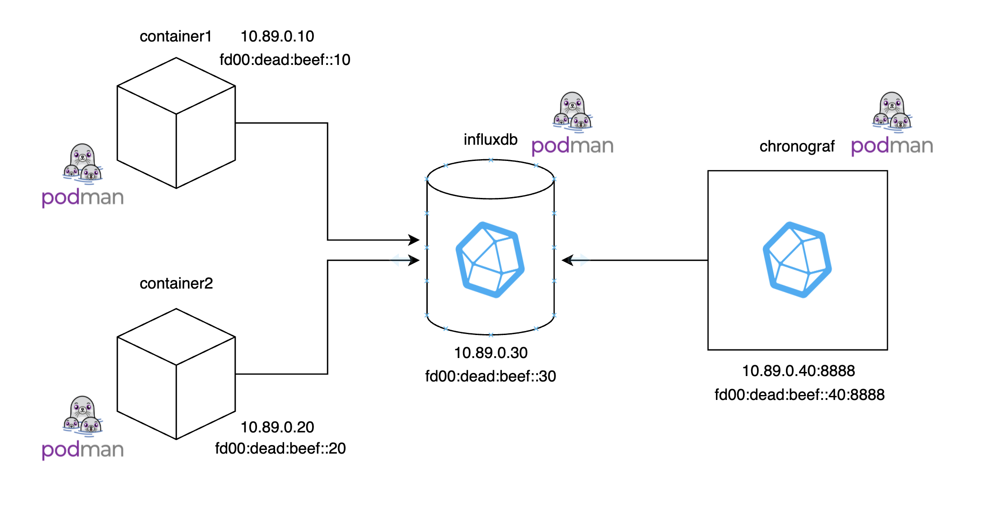

Podman turnkey container where you can test access to the influxdb server using
bridge C libraries.
# eBPF packet filtering and classification

## 🚀 About


The project supply a Podman container that provides a complete environment for testing and developing BPF (Berkeley Packet Filter) programs that filter network packets at the kernel level, while also using InfluxDB for data collection and analysis. The environment is designed to be easily replicable, including all necessary tools for packet filtering, metric management, and container-to-container network connectivity.

With this setup, you will be able to:

Test BPF-based packet filtering on network traffic.
Interact with a local InfluxDB instance using C libraries to write and query data.
Simulate a network between containers using both IPv4 and IPv6 to test complex network scenarios.
This environment is useful for developers and network engineers who want to experiment with BPF and monitoring tools in a replicable setup that can be deployed on any machine running Podman or Docker.


## Getting started

- To **build the image**, you can just run:
```bash
$ podman build --platform linux/amd64 -t podman-influxdb .
```

- Once you have the image, you can **run individually the container** with:
```bash
$ podman run -d --rm --name influxtest -it localhost/podman-influxdb bash
```

```bash
$ podman run -d --rm --name influxtest -v ../libbpf-bootstrap-tc:/opt/shared/libbpf-bootstrap-tc -it --privileged --ulimit memlock=-1 localhost/podman-influxdb bash
```

```bash
$ podman run -d --rm --name influxtest -it --privileged --ulimit memlock=-1 localhost/podman-influxdb bash
```

or you can run them all togheter with:
```bash
$ podman-compose up -d
```

- It is possible to enter the running container:
```bash
$ podman exec -it container1 bash
```

## Try the filter
- To can try the filter you have to chenge your position into the repository:
```bash
$ cd /opt/git/c-influxdb-example/src/c
```

- To update the code at the most recent version and change your branch into the working one:
```
git pull
git switch provaBatch2
```

- To compile the program you can do:
  - ``` make clean ```
  - ``` make -j6 CFLAGS_EXTRA="-DCLASS=1" ```

  In this way, the filter will be active to filter all the ipv4 packet, saving for every packet the 'quintupla' composed by:
   - Source IP
   - Destination IP
   - Source port
   - Destination port
   - Protocol
   
- To change the type of active filter, you have to compile the programe with a different directive, according the following indication:
    - ``` "-DCLASS=2" ```  -> the program will filter all the ipv6 packet, except for the packet with a local address, saving for every packet the 'quintupla'
    - ``` "-DCLASS=3" ```  -> the program will filter all the ipv4 packet saving for everyone only the IP source and destination address
    - ``` "-DCLASS=4" ```  -> the program will filter all the ipv6 packet saving for everyone only the IP source and destination address
    - ``` "-DCLASS=5" ```  -> the program will filter all the ipv4 packet saving for everyone only the destination IP address
    - ``` "-DCLASS=6" ```  -> the program will filter all the ipv6 packet saving for everyone only the destination IP address
    

## Interact with InfluxDB
- To interact with influxdb through the bridging libraries in C, use the test C
program in
```bash
/opt/git/c-influxdb-example
```

- To update the code at the most recent version:
```
git pull
git switch provaBatch2
```

The program must be compiled. When run, the program writes a point to the
```temperature_db``` database in the local influxdb.

- To stop the container individually: ```podman stop influxtest```
- To stop the container with compose: ```podman-compose down```


## Tips
- To can detach the filter if it remain attached
``` tc filter del dev eth0 ingress ```

- Query to can visualize the flows in chronograph ```SELECT "value" FROM "tc_db"."autogen"."rate" WHERE time > now() - 1h```

- To create the ipv6 network used in the compose: ``` podman network create --subnet 10.89.0.0/24 --gateway 10.89.0.1 --ipv6 --subnet fd00:dead:beef::/48 --gateway fd00:dead:beef::1 my_ipv6_network ```

- The IP address of the container are:
  - container1 ipv4 addr: ``` 10.89.0.10 ```
  - container2 ipv4 addr: ``` 10.89.0.20 ```


- To can ping the container container1 to container2 using ipv4 it's mandatory to specify the ipv4 address, for example ``` ping 10.89.0.20 ```

- To can ping the container container1 to container2 using ipv6 you just need to use ``` ping container2 ```

## Schema

